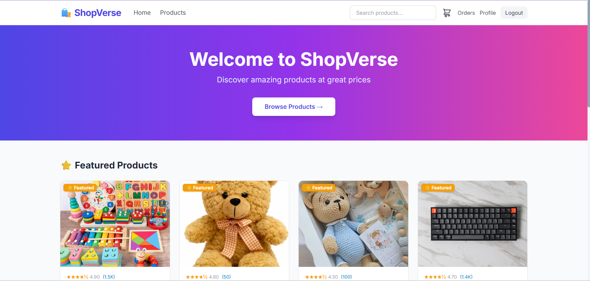
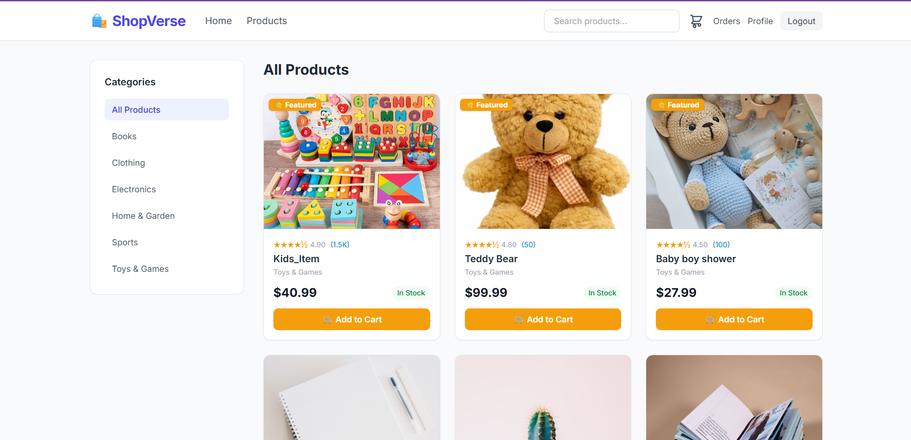

#  ShopVerse — Django Ecommerce Platform

A full-featured ecommerce web application built with Django, featuring product listings, shopping cart, order management, and Stripe payment integration.

---

##  Screenshots

###  Home Page — Featured Products


###  All Products Page


###  Product Detail


---

##  Features

-  Product listing with categories and filters
-  Featured products on homepage
-  Product search and category browsing
-  Shopping cart (session-based)
-  Order management system
-  User authentication (register, login, logout)
-  Stripe payment integration
-  Product image management
-  Responsive design
-  Django Admin panel

---

##  Tech Stack

| Technology | Usage |
|---|---|
| Python 3.12 | Backend language |
| Django 5.1 | Web framework |
| MySQL | Production database |
| WhiteNoise | Static file serving |
| Stripe | Payment processing |
| HTML/CSS/JS | Frontend |

---

##  Project Structure

```
Shopverse_Ecommerce/
├── accounts/          # User authentication
├── cart/              # Shopping cart logic
├── orders/            # Order management
├── products/          # Product & category models
├── shopverse/         # Main Django settings
├── templates/         # HTML templates
├── static/            # CSS, JS, images
├── staticfiles/       # Collected static files
├── media/             # Uploaded product images
│   └── products/      # Product image files
├── .env               # Environment variables (not in git)
├── manage.py
└── requirements.txt
```

---

##  Local Setup

### Prerequisites
- Python 3.12+
- MySQL
- Git

### 1. Clone the repository
```bash
git clone https://github.com/yourusername/shopverse-ecommerce.git
cd shopverse-ecommerce
```

### 2. Create virtual environment
```bash
python -m venv venv

# Windows
venv\Scripts\activate

# Mac/Linux
source venv/bin/activate
```

### 3. Install dependencies
```bash
pip install -r requirements.txt
```

### 4. Configure environment variables

Create a `.env` file in the project root:
```env
SECRET_KEY=your-secret-key-here
DEBUG=True
ALLOWED_HOSTS=localhost,127.0.0.1

DB_NAME=shopverse
DB_USER=root
DB_PASSWORD=yourpassword
DB_HOST=127.0.0.1
DB_PORT=3306

STRIPE_PUBLIC_KEY=your-stripe-public-key
STRIPE_SECRET_KEY=your-stripe-secret-key

SITE_URL=http://localhost:8000
```

### 5. Create MySQL database
```sql
CREATE DATABASE shopverse CHARACTER SET utf8mb4 COLLATE utf8mb4_unicode_ci;
```

### 6. Run migrations
```bash
python manage.py migrate
```

### 7. Create superuser
```bash
python manage.py createsuperuser
```

### 8. Load product images into database
```bash
python manage.py shell
```
Then run the image mapping script (see `docs/seed_images.md`).

### 9. Run the development server
```bash
python manage.py runserver
```

Visit: **http://127.0.0.1:8000**

---

##  Environment Variables

| Variable | Description | Default |
|---|---|---|
| `SECRET_KEY` | Django secret key | Required |
| `DEBUG` | Debug mode | `True` |
| `ALLOWED_HOSTS` | Comma-separated allowed hosts | `localhost,127.0.0.1` |
| `DB_NAME` | MySQL database name | `shopverse` |
| `DB_USER` | MySQL username | `root` |
| `DB_PASSWORD` | MySQL password | `` |
| `DB_HOST` | MySQL host | `127.0.0.1` |
| `DB_PORT` | MySQL port | `3306` |
| `STRIPE_PUBLIC_KEY` | Stripe publishable key | `` |
| `STRIPE_SECRET_KEY` | Stripe secret key | `` |
| `SITE_URL` | Production site URL | `` |

---


##  Product Management

### Via Django Admin
1. Go to `/admin/products/product/`
2. Click any product → upload image → save


##  License

This project is licensed under the MIT License.

---

##  Author

**Monika** — ShopVerse Ecommerce Project

---

 Star this repo if you found it helpful!
